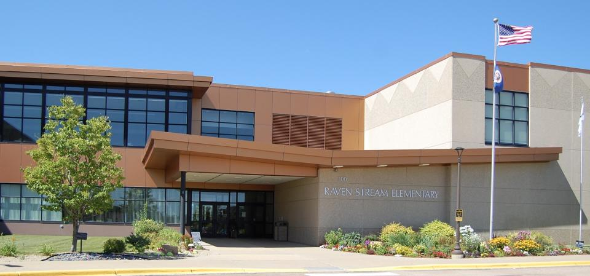

## Pandas Challenge - PyCitySchools

Provides the following reports and analyses based on district-wide standardized test results.

### District Summary
Includes the following key metrics:
* Total Schools
* Total Students
* Total Budget
* Average Math Score
* Average Reading Score
* % Passing Math (The percentage of students that passed math.)
* % Passing Reading (The percentage of students that passed reading.)
* % Overall Passing (The percentage of students that passed math **and** reading.)
 

### School Summary
Includes the following key metrics for each school:
  * School Name
  * School Type
  * Total Students
  * Total School Budget
  * Per Student Budget
  * Average Math Score
  * Average Reading Score
  * % Passing Math (The percentage of students that passed math.)
  * % Passing Reading (The percentage of students that passed reading.)
  * % Overall Passing (The percentage of students that passed math **and** reading.)

### Top Performing Schools (By % Overall Passing)
Identifies the top 5 schools based on the percentage of students that passed both math **and** reading.

### Bottom Performing Schools (By % Overall Passing)
Identifies the bottom 5 schools based on the percentage of students that passed both math **and** reading.

### Scores by School Spending
Displays school performance based on avering spending per student including the following metrics:
  * Average Math Score
  * Average Reading Score
  * % Passing Math (The percentage of students that passed math.)
  * % Passing Reading (The percentage of students that passed reading.)
  * % Overall Passing (The percentage of students that passed math **and** reading.)

### Scores by School Size
Displays school performance based on school size including the following metrics:
  * Average Math Score
  * Average Reading Score
  * % Passing Math (The percentage of students that passed math.)
  * % Passing Reading (The percentage of students that passed reading.)
  * % Overall Passing (The percentage of students that passed math **and** reading.)

### Scores by School Type
Displays school performance based on school type including the following metrics:
  * Average Math Score
  * Average Reading Score
  * % Passing Math (The percentage of students that passed math.)
  * % Passing Reading (The percentage of students that passed reading.)
  * % Overall Passing (The percentage of students that passed math **and** reading.)

### Observations
Identifies 3 trends based on the analyzed data.